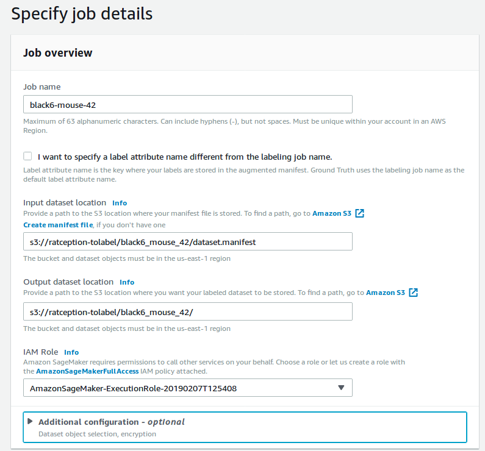
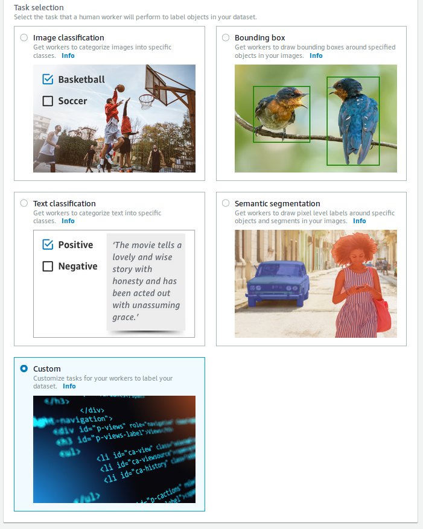

# DANNCE

DANNCE (3-Dimensional Aligned Neural Network for Computational Ethology) is a convolutional neural network (CNN) that extracts the 3D positions of user-defined anatomical keypoints from video of behaving animals. While DANNCE can work with just a single view, it is designed to operate over a set of calibrated cameras.

DANNCE is currently configured as a two-stage system. First, videos are processed to extract the overall position of the animal in each video frame. Then, these positions are used to create *unprojected* 3D image volumes for each view that contain the animal. These image volumes are used as input to the CNN to make keypoint predictions.

## Formatting The Data
During training and evaluation, DANNCE requires a set of videos across multiple views, a camera calibration parameters file, and a "matched frames" file that indexes the videos to ensure synchrony. DANNCE also supports data in the form of individual images and volumetric `.npy` files (used to accelerate training). For evaluation, the default data format is video.

**video directories**.
DANNCE requires a parent video directory with *n* sub-directories, one for each of *n* cameras. Within each subdirectory, videos must be named according the frame index of the first frame in the file. For example, for a three-camera system, the video directory must look like:

./Videos/

+-- Camera1

|\_\_+--0.mp4

+-- Camera2

|\_\_+--0.mp4

+-- Camera3

|\_\_+--0.mp4

DANNCE can also accommodate an additional level of subdirectories if `vid_dir_flag` is set to `False` during configuration. 

./Videos/

+-- Camera1

|\_\_+--3503723726252562

|\_\_\_\_\_+--0.mp4

+-- Camera2

|\_\_+--3503723999451111

|\_\_\_\_\_+--0.mp4

+-- Camera3

|\_\_+--3503723711118999

|\_\_\_\_\_+--0.mp4

**camera calibration parameters**.
DANNCE requires a .mat file for each camera containing the camera's rotation matrix, translation vector, intrinsic matrix, radial distortion, and tangential distortion. To convert from Jesse's calibration format to the required format, use `utils/convert_calibration.m`.

A properly formatted calibration file has the following fields,

`import scipy.io as sio`

`calib = sio.loadmat('Camera1_calib.mat')`

`calib.keys()`

`['R','t','K','RDistort','TDistort']`

**matched frames file**.
To ensure that individual video frames are synchronized at each time point, DANNCE requires an array that associates each time point (in any unit) to an associated video frame in each camera. During dataset formatting, these indices are combined with any available training labels to form the core data representation. For making predictions with DANNCE, these training labels are ignored, although DANNCE still expects to find placeholder label arrays.
- *prediction mode, labeling mode*. Use `utils/preprocess_data.m` to convert Jesse's matched frame files into DANNCE format
- *training mode with motion capture*. Use `utils/preprocess_rd4_noavg.m` to convert Jesse's mocap data structures into DANNCE format
- *training with hand-labeled data*. See **Hand-labeling** below.
    
## Predicting Keypoints With DANNCE

Making predictions with a trained DANNCE network requires 3 steps.

#### 1) Format the data (see above)
#### 2) Find the animal center of mass (COM) in each video frame
You can use your favorite method to find an estimate of the animal COM in each frame. We trained a U-Net to do it. To find the COM with our U-Net, run `predict_COMfinder.py`. This will generate a COM file that is used by DANNCE.

This requires an additional configuration file. See the example @ `./config/COM/modelconfig.cfg`.

#### 3) Run the everything through DANNCE
Given formatted data and a COM file, DANNCE can now predict keypoints from your video streams.
To do this, run `*.py*.`
This requires an additional configuration file. See the example @ ``.

Currently, we provide pre-trained weights for three different versions of DANNCE:

a) Max-DANNCE. This version of DANNCE was trained to output 3D spherical Gaussians for each keypoint. The resolution is lower, and predictions are a bit noisier. However, for now it is the only version that performs well when fine-tuning with mouse data.

b) Avg-DANNCE. This version of DANNCE has an additional spatial average layer that increases output resolution. Works well on rats (and humans).

c) Max-DANNCE (Mouse). Max-DANNCE fine-tuned using hand-labeled mouse data.

## Training The COMfinder U-Net
DANNCE requires a reasonable estimate of the 3D position of the animal in each frame. We obtain this by triangulating the 2D COM of the animal in each frame. Our U-Net is brittle and typically requires some additional training data to get it working on new views, new environments, and new species. If working with hand-labeled data, your same data structures can be used to train the COMfinder network.

Given formatted data, run *

This requires a separate confgiuration file, see the example @ ''.

## Hand-Labeling
Before starting, create an Amazon account and follow the instructions to set up the AWS CLI.

#### 1) Create a new s3 folder
Your images and labeling results need to be stored in a new folder on S3.

`aws s3api put-object --bucket ratception-tolabel --key black6_mouse_42/`

#### 2) Generate random images to label
Given a formatted matched frames file, and yet another config file (see `./config/Labeling/labeling.cfg` for an example), run `./labeling/generate_labels.py`. See the head of the python file for specific usage instructions. This script will also generate a necessary "manifest" file for uploading to S3.

#### 3) Upload the data, the data manifest, and the labeling task template file to your s3 folder
Use ./config/Labeling/mouse.template for mouse.

`aws s3 cp ./labeling/black6_mouse_42/imDir/ s3://ratception-tolabel/black6_mouse_42/ --recursive`

`aws s3 cp ./labeling/black6_mouse_42/dataset.manifest s3://ratception-tolabel/black6_mouse_42/`

`aws s3 cp ./config/Labeling/mouse.template s3://ratception-tolabel/black6_mouse_42/`

#### 4) Start the labeling job
My goal is to have everything working from the command line, but getting this step configured via AWS CLI is complicated. For now, you will need to access the Amazon console from your web browser using this link:

https://458691804448.signin.aws.amazon.com/console/

Search for the "SageMaker: service. Once in, click "Labeling Jobs" in the panel on the left, then click the organe "Create labeling job" button. Then, fill out the form like so:

On the next page, the mouse.template file contents must be copied and pasted into the form.

Press "Submit" and you are ready to go

#### 5) When labeling is completed, download the labels

`mkdir ./labeling/black6_mouse_42/iteration-1`

`aws s3 cp s3://ratception-tolabel/black6_mouse_42/black6-mouse-42/annotations/intermediate/1/annotations.json ./labeling/black6_mouse_42/`

`aws s3 cp s3://ratception-tolabel/black6_mouse_42/black6-mouse-42/annotations/worker-response/iteration-1/ ./labeling/black6_mouse_42/iteration-1 --recursive`

#### 6) Consolidate the labels

Now we run another python script to parse and sort the labels, `./labeling/consolidate_labels.py` 

#### 7) Triangulate and save new data structures for analysis and DANNCE training

Finally, we triangulate and save DANNCE-formatted data using `./labeling/triangulate_manlabels.m`